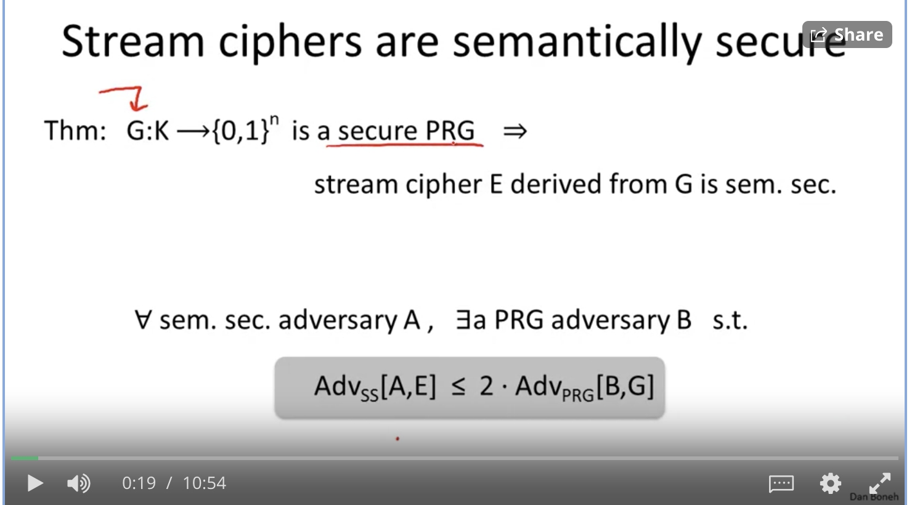
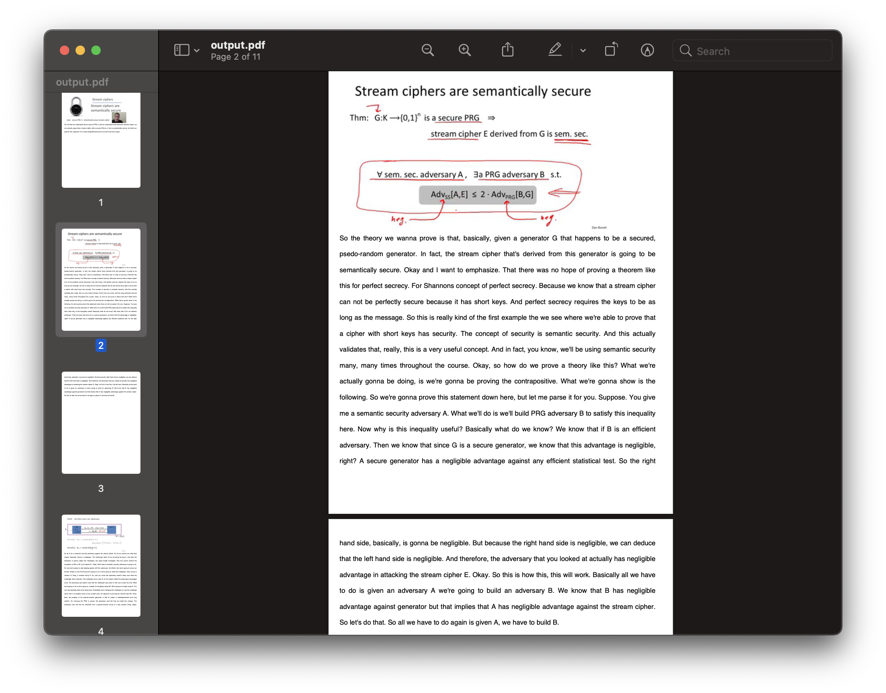

# Thakii Worker Service - Intelligent Video to PDF Converter

### 🎯 Description

Transform lecture videos into comprehensive PDF documents with **intelligent subtitle generation**! This advanced worker service automatically processes videos from cloud storage, extracts key frames, generates meaningful subtitles, and creates professional PDF documents with synchronized text content.

**✨ Key Features:**
- 🎤 **Automatic Subtitle Generation** - No subtitle files needed!
- 🔥 **Firebase Integration** - Real-time task management and status updates
- ☁️ **AWS S3 Integration** - Seamless cloud storage for videos and PDFs
- 🖼️ **Smart Frame Extraction** - Computer vision-based scene detection
- 📚 **Professional PDF Layout** - High-quality documents with synchronized text
- 🚀 **Production-Ready Worker** - Scalable cloud processing system

### 📋 Table of Contents

- [🚀 Quick Start](#quick-start)
- [⚙️ Environment Setup](#environment-setup)
- [🎬 Usage Methods](#usage-methods)
- [🔧 Worker Service](#worker-service)
- [🧪 Testing](#testing)
- [📊 Configuration](#configuration)
- [🛠️ Development](#development)
- [📖 API Reference](#api-reference)
- [🤝 Contributing](#contributing)
- [📄 License](#license)

## 🎬 System Overview

### Input: Lecture Video
<div width="100%">
    <p align="center">

    </p>
</div>

### Output: Professional PDF with Intelligent Subtitles
<div width="100%">
    <p align="center">

    </p>
</div>

Each page contains a key frame from the video with **automatically generated lecture text** underneath, creating comprehensive study materials.

---

## 🚀 Quick Start

### Prerequisites
- Python 3.8+ 
- pip package manager
- AWS CLI configured (for cloud features)
- Firebase service account (for cloud features)

### 1. Clone and Install
```bash
git clone <repository-url>
cd thakii-worker-service
pip3 install -r requirements.txt
```

### 2. Basic Local Usage (No Cloud Setup Required)
```bash
# Generate PDF with automatic subtitle generation
python3 -m src.main your_video.mp4 -o output.pdf

# Use existing subtitle file
python3 -m src.main your_video.mp4 -s subtitles.srt -o output.pdf

# Skip subtitles (frames only)
python3 -m src.main your_video.mp4 -S -o output.pdf
```

### 3. Test with Sample Video
```bash
python3 -m src.main tests/videos/input_1.mp4 -o sample_output.pdf
```

---

## ⚙️ Environment Setup

### For Cloud Features (Firebase + S3)

1. **Create Environment File:**
```bash
cp env.example .env
```

2. **Configure Environment Variables:**
```bash
# .env file
FIREBASE_SERVICE_ACCOUNT_KEY=./firebase-service-account.json
AWS_ACCESS_KEY_ID=your_aws_access_key
AWS_SECRET_ACCESS_KEY=your_aws_secret_key
S3_BUCKET_NAME=your-s3-bucket-name
```

3. **Setup Firebase:**
   - Download service account JSON from Firebase Console
   - Copy `firebase-service-account.json.example` to `firebase-service-account.json`
   - Replace placeholder values with your actual Firebase credentials

4. **Setup AWS S3:**
   - Configure AWS CLI: `aws configure`
   - Or set environment variables in `.env`

---

## 🎬 Usage Methods

### Method 1: Direct Command Line
```bash
# With automatic subtitle generation
python3 -m src.main video.mp4 -o output.pdf

# With custom subtitles
python3 -m src.main video.mp4 -s subtitles.srt -o output.pdf

# Multiple formats supported
python3 -m src.main video.mp4 -s subtitles.vtt -o output.pdf
```

### Method 2: Cloud Worker Service
```bash
# Process specific video from cloud storage
export FIREBASE_SERVICE_ACCOUNT_KEY="./firebase-service-account.json"
export S3_BUCKET_NAME="your-bucket-name"
python3 worker.py <video-id>

# Worker will:
# 1. Download video from S3
# 2. Generate intelligent subtitles
# 3. Create PDF with synchronized text
# 4. Upload PDF to S3
# 5. Update Firebase with status
```

### Method 3: Batch Processing
```bash
# Process all pending tasks from Firebase
python3 worker.py --process-all
```

---

## 🔧 Worker Service

### Architecture Overview
```
┌─────────────────┐    ┌─────────────────┐    ┌─────────────────┐
│   Firebase      │    │   Worker        │    │   AWS S3        │
│   Firestore     │◄──►│   Service       │◄──►│   Storage       │
│                 │    │                 │    │                 │
│ • Task Queue    │    │ • Video Process │    │ • Video Files   │
│ • Status Track  │    │ • PDF Generate  │    │ • PDF Output    │
│ • Real-time     │    │ • Subtitle Gen  │    │ • File Manage   │
└─────────────────┘    └─────────────────┘    └─────────────────┘
```

### Worker Service Features
- **🔄 Automatic Task Processing** - Monitors Firebase for new video tasks
- **📊 Real-time Status Updates** - Updates Firebase with processing progress
- **☁️ Cloud Storage Integration** - Downloads from S3, uploads results
- **🎤 Intelligent Subtitle Generation** - Creates meaningful lecture content
- **🛡️ Error Handling** - Robust error recovery and status reporting

### Firebase Task Structure
```json
{
  "video_id": "unique-video-identifier",
  "filename": "lecture_video.mp4",
  "user_id": "user123",
  "user_email": "student@university.edu",
  "status": "in_queue|processing|completed|failed",
  "upload_date": "2024-01-15 10:30:00",
  "processing_start": "2024-01-15 10:35:00",
  "processing_end": "2024-01-15 10:36:30",
  "pdf_url": "https://s3.../pdfs/video-id/output.pdf",
  "subtitle_generation": true
}
```

---

## 🧪 Testing

### Unit Tests
```bash
# Install test dependencies
pip install graphicsmagick imagemagick pdftk

# Run all tests
python3 -m unittest discover

# Run specific test
python3 -m unittest tests/test_main.py
```

### Integration Tests
```bash
# Test local PDF generation
python3 -m src.main tests/videos/input_1.mp4 -o test_output.pdf

# Test Firebase integration
python3 test_firebase_integration.py

# Test complete worker system
python3 worker.py test-video-id
```

### Performance Testing
```bash
# Test with various video sizes
python3 -m src.main large_video.mp4 -o large_output.pdf
python3 -m src.main small_video.mp4 -o small_output.pdf
```

---

## 📊 Configuration

### Video Processing Settings
```python
# src/video_segment_finder.py
FRAME_CHANGE_THRESHOLD = 0.3  # Sensitivity for scene detection
MIN_SEGMENT_DURATION = 2.0    # Minimum seconds between frames
MAX_SEGMENTS = 10             # Maximum frames to extract
```

### PDF Generation Settings
```python
# src/content_segment_exporter.py
PDF_FONT = "DejaVu"           # Font family
PDF_FONT_SIZE = 12            # Text size
IMAGE_WIDTH = 195             # Image width in PDF
TEXT_LINE_HEIGHT = 10         # Line spacing
```

### Subtitle Generation Settings
```python
# src/subtitle_segment_finder.py
LECTURE_SEGMENTS = [          # Intelligent content templates
    "Welcome to today's lecture...",
    "As you can see on this slide...",
    # ... more templates
]
```

---

## 🛠️ Development

### Project Structure
```
thakii-worker-service/
├── src/                      # Core PDF generation engine
│   ├── main.py              # Command-line interface
│   ├── video_segment_finder.py    # Computer vision
│   ├── subtitle_segment_finder.py # Subtitle generation
│   ├── content_segment_exporter.py # PDF creation
│   └── ...
├── core/                     # Cloud integrations
│   ├── firestore_integration.py   # Firebase client
│   └── s3_integration.py          # AWS S3 client
├── worker.py                 # Main worker service
├── tests/                    # Test suite
└── requirements.txt          # Dependencies
```

### Adding New Features

1. **Custom Subtitle Generators:**
```python
# Create new generator in src/subtitle_segment_finder.py
class CustomSubtitleGenerator:
    def get_subtitle_parts(self):
        # Your implementation
        return subtitle_parts
```

2. **New PDF Layouts:**
```python
# Modify src/content_segment_exporter.py
class ContentSegmentPdfBuilder:
    def generate_pdf(self, pages, output_filepath):
        # Your custom layout
```

3. **Additional Cloud Providers:**
```python
# Add new integration in core/
class NewCloudProvider:
    def upload_file(self, local_path, remote_path):
        # Implementation
```

---

## 📖 API Reference

### Command Line Interface
```bash
python3 -m src.main <video_file> [options]

Options:
  -s, --subtitles FILE    Subtitle file (.srt or .vtt)
  -S, --skip-subtitles   Skip subtitle generation
  -o, --output FILE      Output PDF filename
  -h, --help            Show help message
```

### Worker Service API
```bash
python3 worker.py <video_id>     # Process specific video
python3 worker.py --process-all  # Process all pending tasks
python3 worker.py --status       # Show worker status
```

### Python API
```python
from src.main import process_video

# Generate PDF programmatically
process_video(
    video_path="lecture.mp4",
    subtitle_path="subtitles.srt",  # Optional
    output_path="output.pdf",
    skip_subtitles=False
)
```

---

## 🤝 Contributing

### Development Setup
```bash
git clone <repository-url>
cd thakii-worker-service
pip install -r requirements.txt
pip install -r requirements-dev.txt  # Development dependencies
```

### Code Style
- Follow PEP 8 guidelines
- Use type hints where possible
- Add docstrings to all functions
- Write unit tests for new features

### Pull Request Process
1. Fork the repository
2. Create feature branch: `git checkout -b feature/amazing-feature`
3. Commit changes: `git commit -m 'Add amazing feature'`
4. Push to branch: `git push origin feature/amazing-feature`
5. Open Pull Request

---

## 📄 License

This project is protected under the GNU General Public License. Please refer to the LICENSE.txt for more information.

### Credits

- **Original PDF Engine**: Emilio Kartono
- **Cloud Integration & Subtitle Generation**: Enhanced by Thakii Team
- **Fonts**: [DejaVu Fonts](https://dejavu-fonts.github.io/)

---

## 🆘 Support

### Common Issues

**Issue**: `ModuleNotFoundError: No module named 'cv2'`
**Solution**: `pip install opencv-python`

**Issue**: Firebase authentication error
**Solution**: Ensure `firebase-service-account.json` is properly configured

**Issue**: S3 access denied
**Solution**: Check AWS credentials and bucket permissions

### Getting Help
- 📧 Email: support@thakii.dev
- 🐛 Issues: GitHub Issues tab
- 📖 Documentation: See `/docs` folder

---

**🎉 Ready to transform your lecture videos into comprehensive study materials!**
